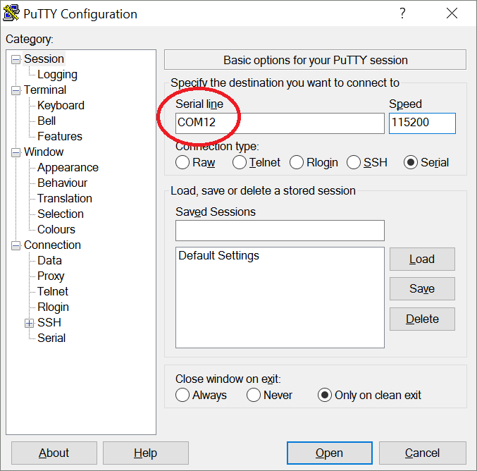

# Innovation-Day: Internet of Things - Hands on Lab

There are different labs depending on the hardware and the level you want to go:
* [Thing Labs](http://thinglabs.io/labs/edison/) is a step by step lab with an Intel Edison board and programming in Node.js
* [Node-Red](node-red_lab.md) will help you setting up a node-red environment and start creating a full IoT solution with it and IoT Hub
* [Connect The Dots](http://connectthedots.io) is a full featured lab that takes at least a full day and provides an end to end solution with devices, IoT services, Stream Analytics, Machine Learning and PowerBI.

But first of all you will need to install your Intel Edison Board. You will need:

* A ssh client (like [putty](http://www.putty.org/))
* The Intel Edison Drivers: [https://software.intel.com/en-us/iot/hardware/edison/downloads]

Once installed you will have something like this in your device manager:

The red mark indicates the COM port you will need to setup in your ssh client:

