# Innovation-Day: Internet of Things - Node-RED Lab

<a href="http://nodered.org"> Node RED</a> is an IoT platform that lets you build IoT Solutions with a graphical interface. It can be installed in any node enabled device, PC or VM.

## Prerequisites
This lab is using the Grove Starter Kit for Intel Edison, so you may have to prepare your device first, just follow this [Intel Edison installation tutorial](installedison.md) and then install the Node-RED environment.

### Node-RED installation

For using node-red with an Intel Edison board you will have to login inside the board and run the following commands:

First install node-red:

```
    npm install -g node-red
```

Then you can install some useful modules like *upm* to use the sensors in the Grove Kit, and also the module to connect to Azure IoT Hub:

```
    npm install -g node-red-contrib-upm && npm install -g node-red-contrib-azureiothubnode
```

### Running Node-RED
You need to know the IP address of your board, just type the command ```ifconfig``` and take your *wlan* address.

Once installed, you can run node-red by typing:

```
    node-red
```

You will see the server running like this:


And to start to use it, you just open a web browser from your client machine using the board address (the one you got using ```ifconfig```).

        http://[boardaddress]:1880

> Whenever you need to stop the server, just press *CTRL+C*, but remember to save your work before stopping the server.

## Start the Node-RED and Azure IoT Hub Lab

Now that you have your environment completely prepared you can begin this step-by-step lab, but feel free to tinker and play with the hardware.

### 1. Connect the Grove Kit sensors
Start by connecting the Grove Base Shield to your Edison Arduino Board.

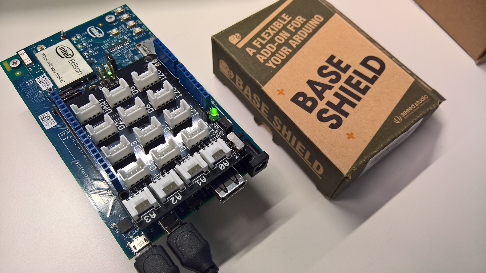

Then you will need to find these components:
- The two LEDs (green and blue)
- The temperature sensor
- The button

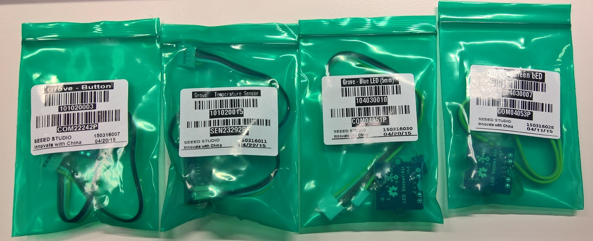

Connect the components to their corresponding ports:

* Green Led : D2
* Grove Button: D3
* Blue Led: D4
* Temp Sensor: A0

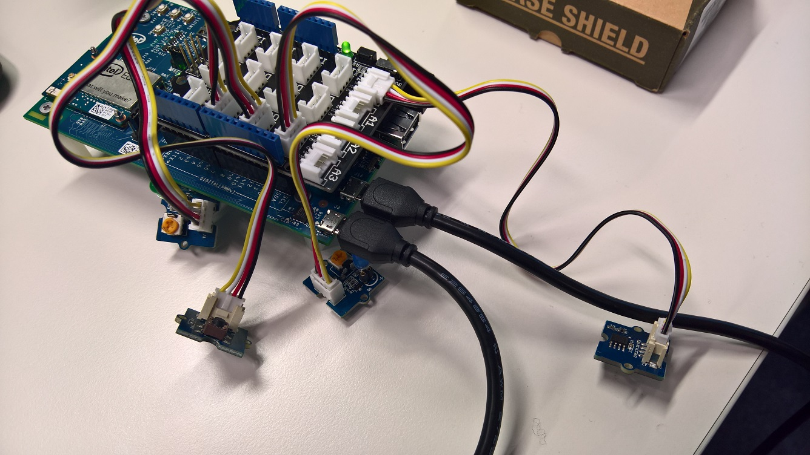

> Notice that the LEDs are connected to **D**igital endpoints and the temperature sensor is connected to an **A**nalog endpoint.

### 2. Create a flow in node-red

#### Start Node-RED
Now, inside the Intel&reg; Edison board you start the node-red server, just typing `node-red`

> Note: you may run `ifconfig` command before running *node-red* to know the ip address of your board.

Open the address http://[edisonipaddress]:1880 with a browser, it's the Node-RED application that lets you create IoT workflows.

#### Make the LEDs blink
In Node-RED you run **Flows** that you edit in your browser app. In a Flow you drag'n'drop the nodes, that provide functionality to your flow.

In the nodes selector, find the **UPM_Sensors** section and drag a *Grove LED* node.


Double clicking the node you can configure it. Set its name to GreenLed and the Pin to D2:

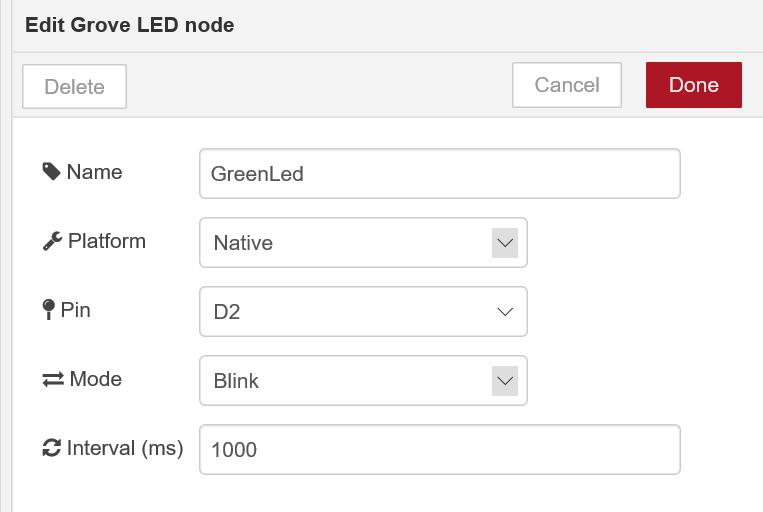

Repeat this operation for the Blue led in D4.

Click on the **Deploy** button, and you must see the two leds blinking.

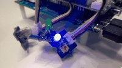

### Create the first Flow

You can connect the nodes to create the program flow: react to events, send data to the cloud, modify a value, etc. We will use a button to turn the green LED on when the button is pressed.

Add a *Grove Button* node, link it to the Green LED and set the Pin to D3:

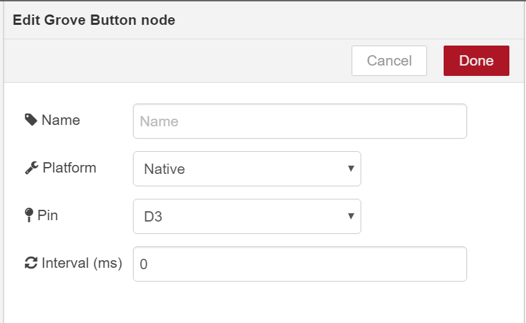

You have to change the configuration of the LED, so it doesn't blink but it reacts to the button operation. You do this by changing the mode to output instead of interval:


Once deployed, you will be able to switch on the green light using the button.

### Use the temperature in the workflow

Now we will use the temperature sensor to change the LED state. Add a *Grove Temperature* node, a *function* node and a *debug* node as well, so we can see the temperatures in the debug tab.


Configure the temperature sensor in the A0 pin and write this function inside the TempThreshold function:

```
var temp = msg.payload;
if(temp>30){
    msg.payload=1;
}
else{
    msg.payload=0;
}
return msg;
```

This code changes the msg.payload, a special property that is used by the nodes and is passed between them, so we are transforming the output payload depending on the input value.

### 3. Create a IoT Hub

To make this data more useful, we will send it to the cloud. We will need some more things for this, here's your bill of materials:
* An Azure account with an IoT Hub service created
* A visualization WebSite
* The Azure node in your Node-RED Flow

Let's do it:

#### Create an IoT Hub

> If you don't have an Azure Account you can get a [Free Trial](https://azure.microsoft.com/free).

In your browser go to the Azure Portal at https://portal.azure.com and login. Create a new IoT Hub with `new > Internet of Things > IoT Hub`.

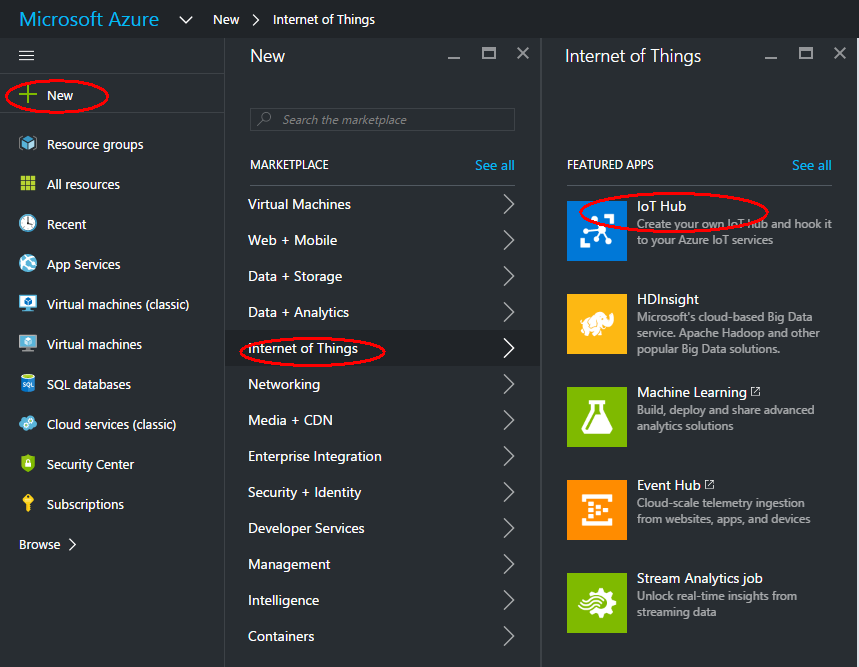

Once created, select the IoT Hub, click on the **Key** icon (Shared access policies) and select **iothubowner** from the policy. Click the **copy** button next to the *Connection String - Primary Key* to copy it to the clipboard.

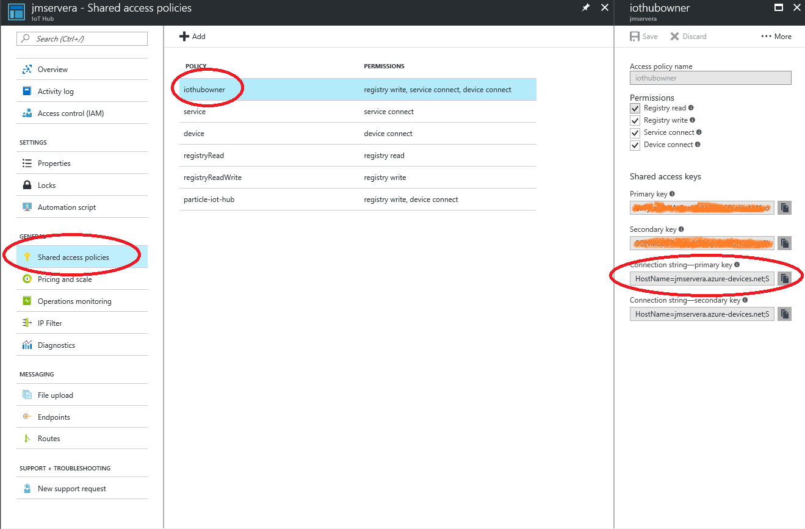

##### Create the IoT Device

Now we will create a secure device Id and Key to connect to the IoT Hub you have created. This is done from your computer using the IoT Hub owner credentials you just copied before.

From your computer, install the IoT Hub Explorer command line:
```
npm install -g iothub-explorer
```

Now, run the following command to get a connection string unique for your device, this allows maximum device security and bi-directional communication with the device:

```
iothub-explorer login "[YOUR CONNECTION STRING]"
iothub-explorer create EdisonNodeRed --connection-string
```

And you will get a screen like this:


Copy the provided connection string, we will use it later.

Add a new function node and connect it to the Temperature output. Write this function inside. It creates a string with a JSON object that we will send through the wire to IoT Hub:

```
msg.payload =JSON.stringify({
    "sensor":"temp",
    "value": msg.payload,
    "timestamp": new Date()
})
return msg;
```
Then add an *azureiothub* node, and set the connection string. The one you got before for the device using the *iothub-explorer*. You will end with a diagram similar to this one:


Once you deploy the diagram, you will start sending data to your IoT Hub.

### 4. Visualize your data

Now you need a dashboard where visualizing the data you are sending, but, before we will prepare it a little bit to show more relevant data, with average, minimum and maximum values. For this we will create an Azure Stream Analytics Job. In the Azure portal go create a new ASA:

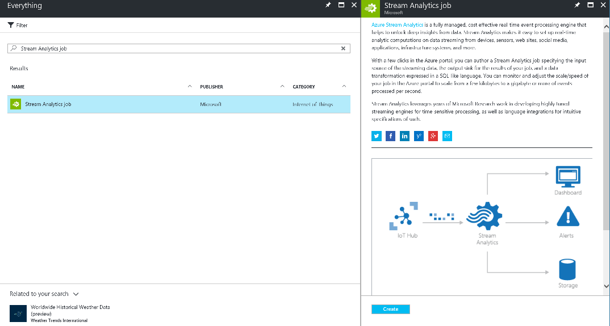

Configure one input as the IoT Hub you created before:


And for the output, we will need to create an Event Hub:


And then configure the Event Hub as the output of the ASA:

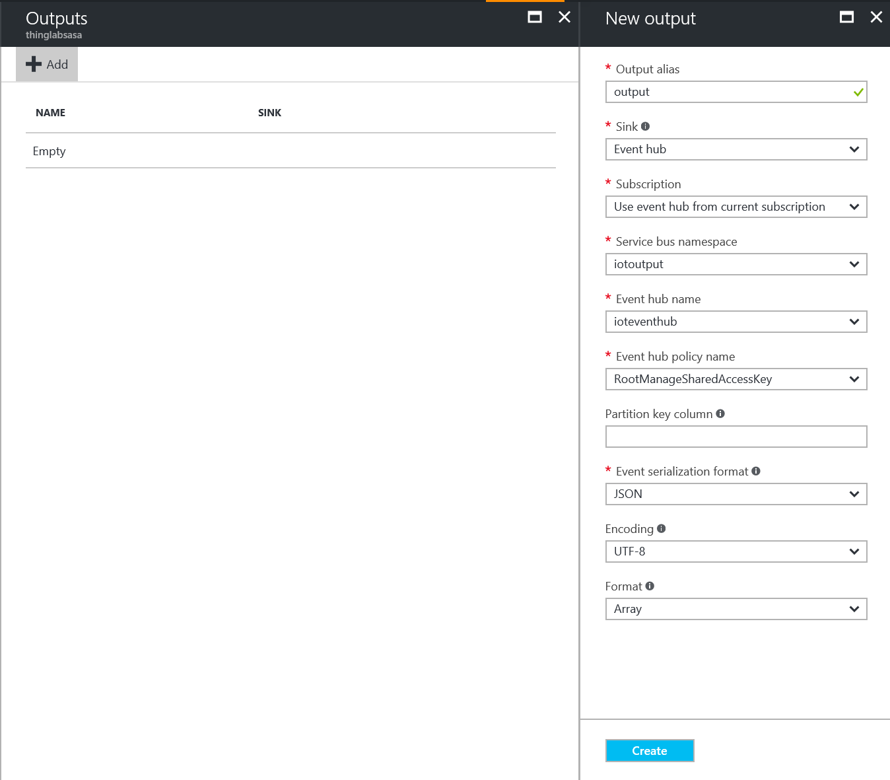

Finally you create a Query and set this select:

    WITH ProcessedData as (
        SELECT
            MAX(sensorValue) MaxTemperature,
            MIN(sensorValue) MinTemperature,
            AVG(sensorValue) AvgTemperature,
            location,
            deviceId,
            System.Timestamp AS Timestamp
        FROM
            [input]
        WHERE
            sensorType = 'temperature'
        GROUP BY
            TumblingWindow (second, 5), deviceId, location
    )

    -- Make sure this matches your Event Hub output name from above,
    -- If you've forgotten it you can go back and get it in another browser tab
    SELECT * INTO [output] FROM ProcessedData

Now you just start this ASA, this will start calculating the minimum, maximum and average every 5 seconds.

To show the result, we have prepared for you a website that draws the data using the d3js library. You will deploy this app to Azure.

> This procedure uses the same site like the one found in [ThingLabs.io](http://thinglabs.io/labs/edison/grove/visualize/)


1. First you create a WebApp by selecting *New > Web + Mobile > Web App*:

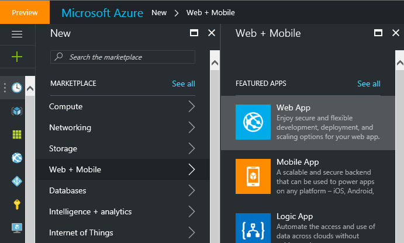

2. Configure the deployment options to an External Repository:


3. And set the *Repository URL* to this one: **https://github.com/ThingLabsIo/ThingLabs-IoT-Dashboard.git**

4. You must set the WebSockets property to on:

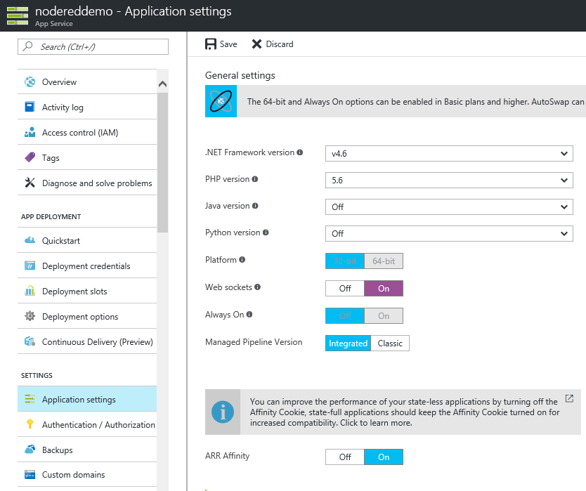

Deploy dashboard: https://github.com/ThingLabsIo/ThingLabs-IoT-Dashboard like in http://thinglabs.io/labs/edison/grove/visualize/


### 5. Receive Cloud to Device messages
Add a new function node and set this code, it converts an array of bytes into a string:

```
msg.payload = 
 String.fromCharCode.apply(null, 
      new Uint16Array(msg.payload));
return msg;
```

Then connect the output of the *Azure IoT Hub* node you already have to the function and the function output to a *debug* node like this:


Now from your command line you can send a message to your device:

```
iothub-explorer send EdisonNodeRed "Hello Node-RED"
```
You can see the messages sent to your device in the *debug* tab:

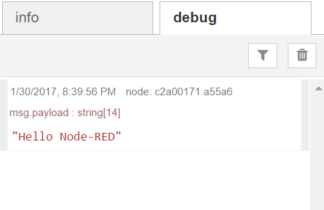
 
## More

You can run Node-RED in many platforms, including Azure: https://nodered.org/docs/platforms/azure

