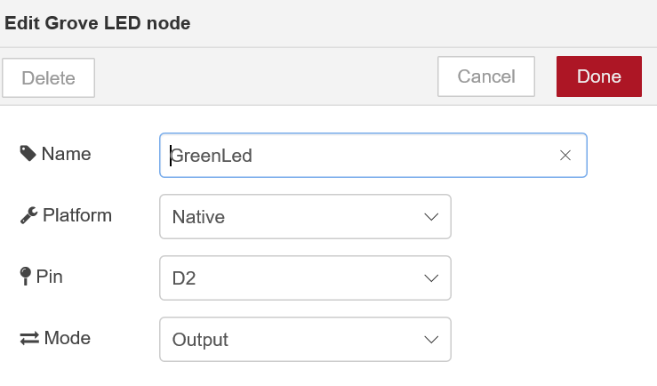

# Innovation-Day: Internet of Things - Node-RED Lab. 2. Work with the sensors

Now that you have your environment completely prepared you can begin this step-by-step lab, but feel free to tinker and play with the hardware.

## 1. Connect the Grove Kit sensors

Start by connecting the Grove Base Shield to your Edison Arduino Board:


Then you will need to find these components:

- The two LEDs (green and blue)
- The temperature sensor
- The button


Connect the components to their corresponding ports:

* Green Led : D2
* Grove Button: D3
* Blue Led: D4
* Temp Sensor: A0


> Notice that the LEDs are connected to **D**igital endpoints and the temperature sensor is connected to an **A**nalog endpoint.

## 2. Create a flow in node-red

### Start Node-RED

Now, inside the Intel&reg; Edison board you start the node-red server, just typing `node-red`

> Note: you may run `ifconfig` command before running *node-red* to know the ip address of your board.

Open the address http://[edisonipaddress]:1880 with a browser, it's the Node-RED application that lets you create IoT workflows.

### Make the LEDs blink

In Node-RED you run **Flows** that you edit in your browser app. In a Flow you drag'n'drop the nodes, that provide functionality to your flow.

In the nodes selector, find the **UPM_Sensors** section and drag a *Grove LED* node.


Double clicking the node you can configure it. Set its name to GreenLed and the Pin to D2:


Repeat this operation for the Blue led in D4.

Click on the **Deploy** button, and you must see the two leds blinking.


### Create the first Flow

You can connect the nodes to create the program flow: react to events, send data to the cloud, modify a value, etc. We will use a button to turn the green LED on when the button is pressed.

Add a *Grove Button* node, link it to the Green LED and set the Pin to D3:


You have to change the configuration of the LED, so it doesn't blink but it reacts to the button operation. You do this by changing the mode to output instead of interval:



Once deployed, you will be able to switch on the green light using the button.

### Use the temperature in the workflow

Now we will use the temperature sensor to change the LED state. Add a *Grove Temperature* node, a *function* node and a *debug* node as well, so we can see the temperatures in the debug tab.


Configure the temperature sensor in the A0 pin and write this function inside the TempThreshold function:

```
var temp = msg.payload;
if(temp>30){
    msg.payload=1;
}
else{
    msg.payload=0;
}
return msg;
```

This code changes the msg.payload, a special property that is used by the nodes and is passed between them, so we are transforming the output payload depending on the input value.

---
Continue to [Step 3](./node-red_lab_3.md) or return to [index](node-red_lab.md).
