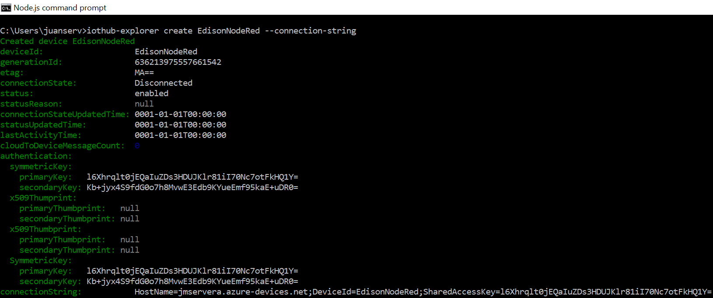
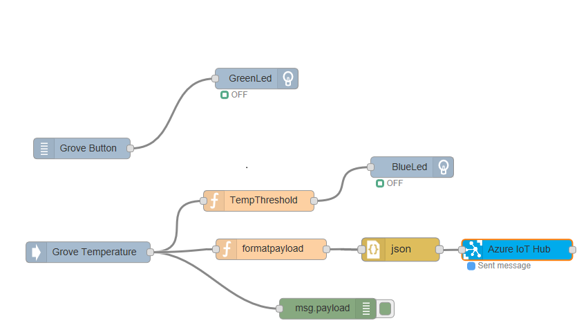

# Innovation-Day: Internet of Things - Node-RED Lab 3. Send data to the cloud

To make this data more useful, we will send it to the cloud. We will need some more things for this, here's your bill of materials:

* An Azure account with an IoT Hub service created
* A visualization WebSite
* The Azure node in your Node-RED Flow

## Create an IoT Hub

> If you don't have an Azure Account you can get a [Free Trial](https://azure.microsoft.com/free).

In your browser go to the Azure Portal at <https://portal.azure.com> and login int your subscription.

You create a new IoT Hub with the menu: `new > Internet of Things > IoT Hub`.


Once created, select the IoT Hub, click on the **Key** icon (Shared access policies) and select **iothubowner** from the policy. Click the **copy** button next to the *Connection String - Primary Key* to copy it to the clipboard.


## Create the IoT Device

Now we will create a secure device Id and Key to connect securely to the IoT Hub you have created. This is done from your computer using the IoT Hub owner credentials you just copied before.

From your computer, install the IoT Hub Explorer command line:

```bash
    npm install -g iothub-explorer
```

Now, run the following command to get a connection string unique for your device, this allows maximum device security and bi-directional communication with the device:

```bash
    iothub-explorer login "[YOUR CONNECTION STRING]"
    iothub-explorer create EdisonNodeRed --connection-string
```

And you will get a screen like this:



Copy the provided connection string for your device, we will use it later.

## Connect to IoT Hub from NodeRED

In the Node-RED flow you created before, add a new function node and connect it to the Temperature output. Write this function inside, it creates a string with an object that we will send through the wire to IoT Hub:

```javascript
    msg.payload={
        deviceId: "Id1",
            location: "[Write your city here]",
            sensorType: "temperature",
            sensorValue: msg.payload
    }
    return msg;
```

Then add an *azureiothub* node, and set the connection string you got for your device, not the general IoT Hub connection string, but the particular one for the device. The one you got before for the device using the *iothub-explorer*. Finally, prior to sending the payload you must convert it to a JSON string, this can be done directly in your function using the `JSON.stringify` method or you can add a simple *JSON node* that will convert it for you. You will end with a diagram similar to this one:



Once you deploy the diagram, you will start sending data to your IoT Hub, you will see a *Connected* message in the IoT Hub node.

---
Continue to [Step 4](./node-red_lab_4.md) or return to [index](node-red_lab.md).